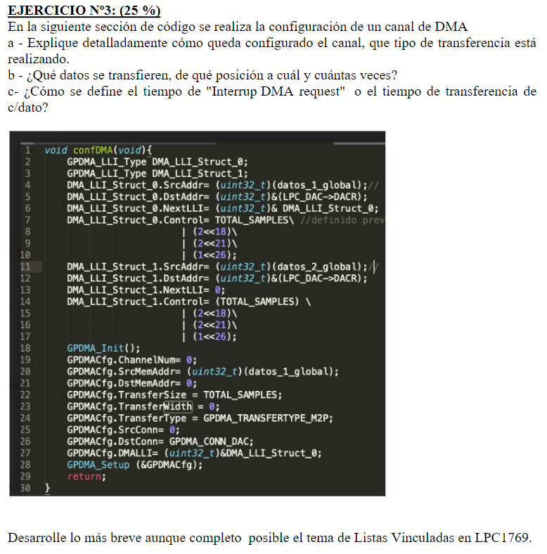

# Ejercicio 3 - Parcial 2 2022

  

## a) **Explicación detallada del código y configuración del canal de DMA:**

En este código, se está utilizando la estructura **LLI** (**Linked List Item**) para configurar un canal de **DMA** en el **LPC1769**. La estructura **LLI** permite al **DMA** realizar transferencias de múltiples bloques de datos, que pueden estar separados en la memoria (osea, no son contiguos), de manera secuencial sin la intervención del procesador, encadenando las transferencias mediante una lista vinculada (**Linked List**).

En este caso, el código configura el **DMA** para transferir datos desde la memoria (**datos_1_global** y **datos_2_global**) hacia el **DAC** (convertidor digital-analógico) en el microcontrolador **LPC1769**. Aquí se detalla cada componente:

1. **Estructuras LLI**:
   - **DMA_LLI_Struct_0** y **DMA_LLI_Struct_1** son las dos estructuras de lista vinculada utilizadas. Cada estructura define una transferencia específica y un enlace al siguiente bloque de datos que será transferido.
   - En **DMA_LLI_Struct_0**, se configura la transferencia de **datos_1_global** al **DAC**, y cuando se complete, la transferencia seguirá con **DMA_LLI_Struct_1**, que transferirá **datos_2_global** al **DAC**.
   - **NextLLI** define la dirección de la siguiente lista vinculada a ejecutar, permitiendo transferencias encadenadas.

2. **Configuración del Control (Control)**:
   - El campo **Control** define la configuración de la transferencia, incluyendo el tamaño de la transferencia (número de muestras), el ancho de los datos, y las configuraciones de la transferencia.
   - **DMA_SIZE | (2 << 18) | (2 << 21) | (1 << 26)**:
     - **DMA_SIZE** es el número total de muestras a transferir.
     - **2 << 18**: Especifica que el tamaño de las transferencias desde la fuente es de 32 bits (4 bytes).
     - **2 << 21**: Especifica que el tamaño de las transferencias de destino es de 32 bits (4 bytes).
     - **1 << 26**: Incrementa la dirección de destino cada vez que se realiza una transferencia.

3. **Configuración del canal de DMA (GPDMA_Setup)**:
   - La función **GPDMA_Setup** configura el canal de **DMA** para iniciar la transferencia. Se define la fuente (**SrcMemAddr**) y el destino (**DstMemAddr**), que en este caso es el registro del **DAC**.
   - La transferencia es del tipo **memoria a periférico** (M2P), ya que los datos se transfieren desde la memoria (**datos_1_global**) al **DAC**.

### b) **Datos transferidos, posiciones y cantidad:**

- **Datos transferidos**:
  - Los datos que se están transfiriendo son los contenidos en las variables **datos_1_global** y **datos_2_global**. Estos son bloques de datos que se almacenan en la memoria.
  - **Origen de los datos**: **datos_1_global** y **datos_2_global**, que son punteros a las direcciones de memoria donde están almacenados los datos.
  - **Destino de los datos**: El destino de la transferencia es el registro del **DAC** del **LPC1769** (**LPC_DAC->DACR**), que es donde se envían los datos para convertirlos de digital a analógico.
  
- **Cantidad de transferencias**:
  - La cantidad de muestras a transferir es **TOTAL_SAMPLES**, que es una constante definida en el código y especifica el número total de muestras en cada transferencia.
  - Se realizan dos bloques de transferencia: uno de **datos_1_global** y otro de **datos_2_global**. Cuando la primera transferencia (de **datos_1_global**) se completa, la segunda transferencia (de **datos_2_global**) comienza automáticamente gracias a la lista vinculada.

### c) **Tiempo de "Interrupt DMA request" o tiempo de transferencia por dato:**

El tiempo que define cuándo se genera la interrupción del **DMA** o el tiempo de transferencia por dato depende de dos factores:

1. **Tamaño de la transferencia**:
   - En el campo **Control** de la estructura **LLI**, se indica el número de muestras (**TOTAL_SAMPLES**) que se van a transferir en cada bloque.
   - La interrupción del **DMA** se genera cuando el **DMA** ha transferido todas las muestras definidas por **TOTAL_SAMPLES**, si es que la interrupción está habilitada a través del bit **(1 << 30)** en el campo **Control**, que habilita la interrupción del **DMA** al finalizar la transferencia.

2. **Frecuencia del periférico (DAC)**:
   - El tiempo que tarda en transferirse cada dato está determinado por la frecuencia de operación del **DAC** y la velocidad del reloj del **DMA**. En este caso, como el **DAC** es el destino de la transferencia, el tiempo de actualización del **DAC** (definido por el reloj del sistema) juega un papel importante en el tiempo total de la transferencia.
   - El **DAC** del **LPC1769** puede trabajar con una frecuencia máxima de hasta 1 MHz en modo rápido, lo que significa que puede procesar hasta 1 millón de muestras por segundo. Si estás operando a una frecuencia de actualización más baja, el tiempo por muestra será mayor.

### Tema de Listas Vinculadas en el LPC1769

En el **LPC1769**, el **DMA** puede utilizar **Listas Vinculadas (LLI - Linked List Item)** para realizar múltiples transferencias de manera secuencial sin necesidad de intervención del procesador. Esto permite realizar transferencias automáticas y eficaces, especialmente útiles en aplicaciones como generación de señales, donde es necesario enviar continuamente datos a un periférico, como el **DAC**.

1. **Estructura LLI**

- Cada elemento de la **LLI** contiene información sobre la fuente, el destino, el tamaño de la transferencia y un puntero a la siguiente estructura **LLI**. Esto permite que las transferencias de **DMA** se encadenen sin necesidad de intervención por software.

2. **Puntero a la siguiente transferencia**

- El campo **NextLLI** de la estructura **LLI** contiene la dirección del siguiente elemento en la lista vinculada. Cuando se completa la transferencia actual, el **DMA** pasa automáticamente al siguiente elemento en la lista y continúa la transferencia.

3. **Ventajas de las listas vinculadas**:

- **Eficiencia**: Permiten realizar transferencias grandes o secuenciales sin requerir intervención del procesador, reduciendo la carga en la CPU.
- **Automatización**: Facilitan la automatización de tareas, como la generación continua de señales con el **DAC** o el procesamiento de múltiples bloques de datos.
- **Flexibilidad**: Permiten encadenar varias transferencias con diferentes fuentes y destinos.

En resumen, las **LLI** permiten al **DMA** del **LPC1769** gestionar de manera eficiente transferencias de datos complejas, reduciendo la carga de trabajo del procesador y aumentando el rendimiento del sistema.
