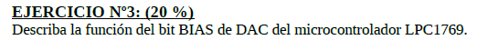

# Ejercicio 3 - Parcial 2 2023

<div style="text-align: center;">
  
</div>

El **bit BIAS** del **DAC** en el microcontrolador **LPC1769** tiene la función de **controlar el modo de corriente** del DAC, afectando tanto el **consumo de energía** como la **velocidad de conversión**. Permite ajustar el equilibrio entre el **rendimiento** y el **consumo de energía** en el **DAC** del **LPC1769** según las necesidades de la aplicación.

## Función del bit BIAS del DAC

El bit **BIAS** del **DAC** tiene dos posibles configuraciones:

1. **BIAS = 0**: **Modo rápido** (máxima velocidad de conversión).
   - En este modo, el **DAC** opera a su velocidad máxima, lo que permite realizar conversiones más rápidas.
   - Sin embargo, este modo consume más energía.
   - El **tiempo de conversión** es más bajo (alrededor de **1 µs**).
   - La **frecuencia** es más alta (**1 MHz** como maximo)

2. **BIAS = 1**: **Modo de bajo consumo**.
   - En este modo, el **DAC** opera a una velocidad más lenta, lo que reduce el consumo de energía.
   - El **tiempo de conversión** es más alto (alrededor de **2.5 µs**).
   - Es ideal cuando no se necesita una conversión rápida y se busca minimizar el consumo de energía.
   - La **frecuencia** es más baja (**400 KHz** como maximo)

## Uso del bit BIAS

- El bit BIAS se utiliza para optimizar el **rendimiento del DAC** en función de las necesidades de la aplicación. Si la aplicación requiere **alta velocidad de conversión**, se puede configurar el DAC en modo rápido (**BIAS = 0**), pero si la prioridad es **ahorrar energía**, el modo de bajo consumo (**BIAS = 1**) es más adecuado.

## Ejemplo de uso en código

```c
// Configurar el DAC en modo rápido (BIAS = 0)
LPC_DAC->DACR &= ~(1 << 16);  // BIAS = 0, modo rápido

// Configurar el DAC en modo de bajo consumo (BIAS = 1)
LPC_DAC->DACR |= (1 << 16);  // BIAS = 1, modo bajo consumo
```

Tambien se puede hacer lo siguiente utilizando CMSIS:

```c
DAC_SetBias(LPC_DAC, 0); // Modo rápido
DAC_SetBias(LPC_DAC, 0); // Modo de bajo consumo
```
