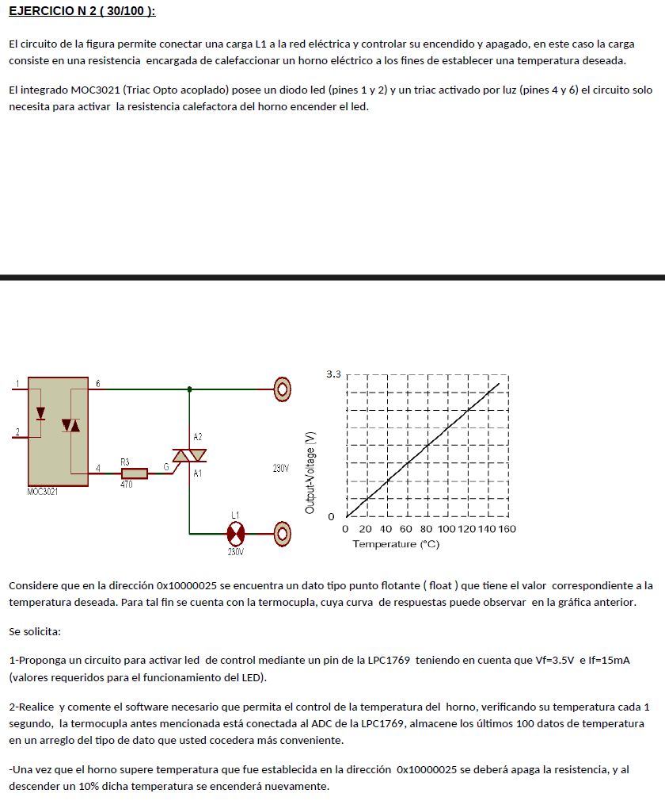

# Ejercicio 2 - Recuperatorio Parcial 2 2018

Este ejercicio pide realizar el control de temperatura de un horno eléctrico usando un microcontrolador **LPC1769**, una termocupla conectada al **ADC** (convertidor analógico-digital), y un **optotriac MOC3021** para encender o apagar una resistencia calefactora.

<div style="text-align: center;">
  
</div>

## Parte 1: Circuito para activar el LED de control con un pin

- El **LED del MOC3021** (pines 1 y 2) se activa con una corriente de **15mA** y un voltaje de **3.5V** (según el valor del **Vf** del LED), pero la **LPC1769** ofrece una salida de **3.3V** en sus pines de GPIO, lo que no es suficiente para activar el LED directamente, ya que el **Vf** del LED es **3.5V**, y se necesita más corriente. Por lo tanto, habrá que utilizar un **transistor** para amplificar la corriente.

### Circuito Propuesto

1. Conectar un pin GPIO del **LPC1769** a la base de un **transistor NPN**, que funciona con **lógica positiva**, por lo que en el pin deberemos configurar una **resistencia de Pull-Down** (si fuese un PNP, seria de Pull-Up).
2. El **colector** del transistor se conecta al **cátodo** del **LED** del **MOC3021** (pin 2) (si fuese un PNP, el colector se conecta al ánodo del LED).
3. El **emisor** del transistor se conecta a **tierra** (si fuese un PNP, el emisor se conecta a Vcc).
4. Se coloca una **resistencia** entre la base del transistor y el pin del **LPC1769** para limitar la corriente base (por ejemplo, **1kΩ**).
5. La otra terminal del **LED del MOC3021** (pin 1) se conecta a **3.5V**, junto con una resistencia en serie para limitar la corriente a **15mA**. Se puede calcular la resistencia usando la ley de Ohm:

   $$
   R = \frac{V_{fuente} - V_{f}}{I_f} = \frac{3.5V - 1.2V}{0.015A} \approx 150 \Omega
   $$

   Donde 1.2V es el **VCEsat** del transistor.

### Parte 2: Código en C para el control de la temperatura

El código deberá realizar lo siguiente:

- Leer el valor de la termocupla cada segundo utilizando el **ADC**.
  - Cada segundo, el código lee el valor del **ADC**, lo convierte a voltaje y luego a temperatura usando la relación proporcionada (160 °C a 3.3V).
  - El valor de temperatura se almacena en un arreglo circular de 100 elementos.
- Controlar la activación y desactivación de la resistencia calefactora utilizando el **MOC3021**.
  - Comparar la temperatura medida con el valor de referencia almacenado en la dirección de memoria **0x10000025**.
  - Si la temperatura actual supera la temperatura deseada, se apaga la resistencia (se apaga el **MOC3021**).
  - Si la temperatura baja por debajo del **90%** de la temperatura deseada, se enciende la resistencia nuevamente.

#### Código básico en C usando CMSIS

```c
#include "LPC17xx.h"
#include "lpc17xx_adc.h"
#include "lpc17xx_gpio.h"
#include "lpc17xx_timer.h"
#include "lpc17xx_pinsel.h"

#define ADC_CHANNEL_2 2  // Suponiendo que la termocupla está conectada al canal 2 del ADC
#define MOC3021_PIN (1 << 20)  // Suponiendo que el MOC3021 está conectado al pin P0.20
#define TEMPERATURE_ADDRESS 0x10000025  // Dirección de la temperatura deseada
#define ADC_FREQ 100000
#define SAVED_TEMPS 100
#define OUTPUT 1

float temperatura_deseada = *(float *)TEMPERATURE_ADDRESS;  // Lee la temperatura deseada desde memoria
float temperaturas[SAVED_TEMPS];  // Arreglo para almacenar los últimos 100 valores de temperatura
uint8_t indice = 0;  // Índice para el arreglo de temperaturas

void config_pins(void) {
    // Configurar P0.20 como GPIO
    PinCfg.Portnum = PINSEL_PORT_0;
    PinCfg.Pinnum = 20;
    PinCfg.Funcnum = PINSEL_FUNC_0;  // Función GPIO
    PinCfg.Pinmode = PINSEL_PINMODE_DOWN;  // Pull-down activado
    PinCfg.OpenDrain = PINSEL_PINMODE_NORMAL;  // Modo normal
    PINSEL_ConfigPin(&PinCfg);

    // Configurar el pin del MOC3021 como salida
    GPIO_SetDir(PINSEL_PORT_0, MOC3021_PIN, OUTPUT);  // P0.20 como salida
}

void config_adc(void) {
    // Configurar el ADC
    ADC_Init(LPC_ADC, ADC_FREQ);  // Inicializar ADC con frecuencia de 100 kHz
    ADC_ChannelCmd(LPC_ADC, ADC_CHANNEL_2, ENABLE);  // Habilitar canal 2 del ADC
}

void config_timer0(void) {
    // Configurar el Timer0 para generar una interrupción cada 1 segundo (1 Hz)
    TIM_TIMERCFG_Type TimerCfg;
    TIM_MATCHCFG_Type MatchCfg;

    // Configuración básica del Timer
    TimerCfg.PrescaleOption = TIM_PRESCALE_USVAL;  // Usamos microsegundos
    TimerCfg.PrescaleValue = 1000;  // El contador aumenta cada 1 ms
    TIM_Init(LPC_TIM0, TIM_TIMER_MODE, &TimerCfg);

    // Configuración del Match (cada 1 segundo)
    MatchCfg.MatchChannel = 0;
    MatchCfg.IntOnMatch = ENABLE;  // Habilitar interrupción por Match
    MatchCfg.ResetOnMatch = ENABLE;  // Reiniciar el timer en cada match
    MatchCfg.StopOnMatch = DISABLE;
    MatchCfg.MatchValue = 1000;  // Generar evento cada 1 segundo
    TIM_ConfigMatch(LPC_TIM0, &MatchCfg);

    // Habilitar la interrupción del Timer0
    NVIC_EnableIRQ(TIMER0_IRQn);
}

void TIMER0_IRQHandler(void) {
    // Obtener lectura del sensor de temperatura cuando se alcance el Match
    leer_temperatura(void);

    // Limpiar la bandera de interrupción del Timer0
    TIM_ClearIntPending(LPC_TIM0, TIM_MR0_INT);
}

void leer_temperatura(void) {
    // Iniciar la conversión del ADC
    ADC_StartCmd(LPC_ADC, ADC_START_NOW);

    // Esperar a que la conversión termine
    while (!ADC_ChannelGetStatus(LPC_ADC, ADC_CHANNEL, ADC_DATA_DONE));

    // Leer el valor del ADC y convertirlo a voltaje (0-3.3V) y luego a temperatura
    uint16_t valor_adc = ADC_ChannelGetData(LPC_ADC, ADC_CHANNEL);
    float voltaje = (valor_adc / 4095.0); // (valor_adc / 2^12-1) * 3.3
    float temperatura_actual = voltaje * 160.0;  // Convertir a temperatura en °C (voltaje * 160.0) / 3.3 (3.3/3.3 = 1)

    // Almacenar la temperatura en el arreglo
    temperaturas[indice] = temperatura_actual;
    indice++;
    if (indice == SAVED_TEMPS) {
        indice = 0;
    };

    // Controlar resistencia
    if (temperatura_actual >= temperatura_deseada) {
        // Si la temperatura supera la deseada, apaga la resistencia
        GPIO_ClearValue(0, MOC3021_PIN);
    } else if (temperatura_actual <= temperatura_deseada * 0.9) {
        // Si la temperatura cae por debajo del 90% de la deseada, enciende la resistencia
        GPIO_SetValue(0, MOC3021_PIN);
    }
}

int main(void) {
    // Inicialización
    SystemInit();
    config_pins();
    config_adc();
    config_timer0();

    // Iniciar el Timer0
    TIM_Cmd(LPC_TIM0, ENABLE);

    while (1) {

    }

    return 0;
}
