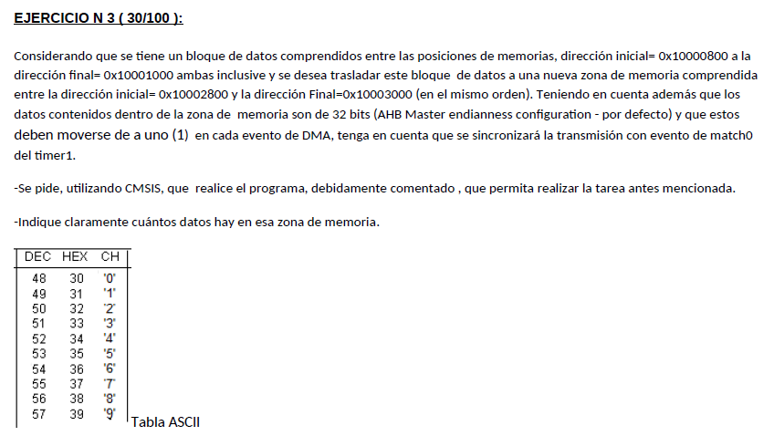

# Ejercicio 3 - Recuperatorio Parcial 2 2018

Este ejercicio es practicamente igual al ejercicio 3 del parcial 2 de 2018, con la diferencia de que los datos se mueven de a 32 bits

<div style="text-align: center;">
  
</div>

## Puntos a tener en cuenta

## Puntos a tener en cuenta

### 1. **Direcciones de fuente y destino**

- **Fuente de datos (Source Address)**: El bloque de datos comienza en la dirección **0x10000800** y termina en **0x10001000**. Esto define la ubicación inicial de los datos que se deben transferir.
- **Destino de datos (Destination Address)**: El bloque de datos debe moverse a la dirección inicial **0x10002800** y la final **0x10003000**. Esta es la ubicación de destino donde se copiarán los datos.

### 2. **Tamaño del Bloque de Datos, Tamaño de los Datos y Cantidad de Transferencias necesarias**

- El tamaño total de los datos es de **0x10003000 - 0x10002800 = 0x200 bytes** (512 bytes en total).
- Los datos deben ser tratados como **datos de 32 bits** debido a la configuración de la arquitectura **AHB Master (endianness)**.
- Esto significa que los datos deben transferirse en bloques de **4 bytes** por operación de DMA, por lo que el número total de transferencias necesarias será de **512 / 4 = 128 transferencias**.
- **Número de datos en la zona de memoria**: Hay **128 datos de 32 bits** en la memoria de origen (de **0x10000800** a **0x10001000**).

### 3. **Modo de transferencia del DMA**

- El DMA debe configurarse en modo **Memoria-a-Memoria** (`M2M`). Esto significa que los datos se leerán desde una dirección en la memoria y se copiarán a otra dirección en la memoria.

### 4. **Estructura de Linked List Item para optimizar las transferencias**

- Una LLI nos permitirá recorrer todo el bloque de memoria de origen a la par del de destino luego de cada transferencia finalizada.
- Esta estructura también nos otorga la posibilidad de generar una **interrupción** al finalizar la transferencia, lo que nos asegura que las transferencias ocurren de forma organizada a lo largo del tiempo. Además, nos permite controlar cuantas transferencias se han realizado adecuadamente.

### 5. **Sincronización con Timer1**

- Las transferencias de DMA deben sincronizarse con el evento de coincidencia (*match*) del **Timer1**. Específicamente, se debe configurar el DMA para que una transferencia ocurra cada vez que se produzca el evento **Match0 del Timer1**.
- Para ello, utilizamos la interrupción del Timer al llegar al Match, que será el momento en el que disparemos la orden de iniciar una transferencia.

### Código en C

```c
#include "LPC17xx.h"
#include "lpc17xx_gpdma.h"
#include "lpc17xx_timer.h"

// Memory addresses
#define SRC_ADDRESS 0x10000800
#define DST_ADDRESS 0x10002800

// DMA definitions
#define DMA_CHANNEL_0 0
#define REQUIRED_TRANSFERS 128; // 0x10003000 - 0x10002800 = 0x200 bytes = 512 bytes -> 512 / 4 bytes (transferencias de 32 bits) = 128 transferencias

// Global variables
volatile uint8_t remaining_transfers = REQUIRED_TRANSFERS; // De 8 bits porque son 128 transferencias (8 bits llega a 255)

// Required structures for DMA
GPDMA_Channel_CFG_Type dma;
GPDMA_LLI_Type lli;

void configure_dma(void) {
    lli.SrcAddr = (uint32_t)SRC_ADDRESS;
    lli.DstAddr = (uint32_t)DST_ADDRESS;
    lli.NextLLI = (uint32_t)&lli;
    lli.Control = 1        // 1 transferencia a la vez
                | (2<<17)  // Transferencia a la fuente de 32 bits
                | (2<<21)  // Transferencia de destino de 32 bits
                | (1<<25)  // Incrementa direccion de origen despues de cada transferencia
                | (1<<26)  // Incrementa direccion de destino despues de cada transferencia
                | (1<<30)  // Generar interrupcion al finalizar transferencia y detener transferencia (se reinicia manualmente)

    // Configuración del canal DMA
    dma.ChannelNum = DMA_CHANNEL_0;                  // Canal DMA 0
    dma.TransferSize = 1;                            // 1 transferencia a la vez
    dma.TransferWidth = GPDMA_WIDTH_WORD;            // Transferencias de 32 bits
    dma.SrcMemAddr = (uint32_t)SRC_ADDRESS;          // Dirección de origen
    dma.DstMemAddr = (uint32_t)DST_ADDRESS;          // Dirección de destino
    dma.TransferType = GPDMA_TRANSFERTYPE_M2M;       // Transferencia memoria a memoria
    dma.DMALLI = (uint32_t)&lli;                     // Linked List Item
    dma.SrcConn = 0;                                 // No hay periférico de origen
    dma.DstConn = 0;                                 // No hay periférico de destino
    
    // Configurar el DMA
    GPDMA_Setup(&dma_cfg);
    
    // Iniciar modulo DMA
    GPDMA_Init();

    // Habilita interrupcion del DMA
    NVIC_EnableIRQ(DMA_IRQn);
    // Transferencia > Orden de transferir otro dato
    NVIC_SetPriority(DMA_IRQn, 0);
}

// Configurar Timer1 y Match0 para generar un evento periódico
void configure_timer1(void) {
    TIM_TIMERCFG_Type timer_cfg;
    TIM_MATCHCFG_Type match_cfg;

    // Configuración básica del timer
    timer_cfg.PrescaleOption = TIM_PRESCALE_USVAL;
    timer_cfg.PrescaleValue = 1;  // El contador aumenta cada 1 us
    TIM_Init(LPC_TIM1, TIM_TIMER_MODE, &timer_cfg);

    // Configurar Match0 para generar eventos
    match_cfg.MatchChannel = 0;
    match_cfg.IntOnMatch = ENABLE;
    match_cfg.ResetOnMatch = ENABLE;
    match_cfg.StopOnMatch = ENABLE; // Cuando se llega al Match, se reinicia y detiene la cuenta hasta finalizar la transferencia
    match_cfg.MatchValue = 1000; // Generar evento cada 1 ms (1 us * 1000)
    TIM_ConfigMatch(LPC_TIM1, &match_cfg);

    // Habilita interrupcion del Timer1
    NVIC_EnableIRQ(Timer1_IRQn);
    // Transferencia > Orden de transferir otro dato
    NVIC_SetPriority(Timer1_IRQn, 3);
}

void TIMER1_IRQHandler(void) {
    // Reiniciar transferencia por DMA
    GPDMA_ChannelCmd(0, ENABLE);
    // Limpiar flag de interrupcion Timer1
    TIM_ClearIntPending(LPC_TIM1, TIM_MR0_INT); 
}

void DMA_IRQHandler() {
    remaining_transfers--;
    // Si quedan transferencias por hacer, se vuelve a activar el Timer
    if (remaining_transfers != 0) {
      // Limpiar flag de interrupcion DMA
      GPDMA_ClearIntPending(GPDMA_STATCLR_INTTC, DMA_CHANNEL_0);
      // Iniciar Timer1
      TIM_Cmd(LPC_TIM1, ENABLE);
    }
}

int main(void) {
    // Iniciar system clk
    SystemInit();

    // Configurar el Timer1 y el DMA
    configure_timer1();
    configure_dma();
   
    // Iniciar Timer1
    TIM_Cmd(LPC_TIM1, ENABLE);

    while (1) {
        // El DMA se encargará de la transferencia
    }

    return 0;
}
