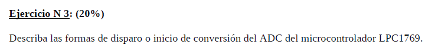

# Ejercicio 3 - Recuperatorio Parcial 2 2023

<div style="text-align: center;">
  
</div>

El **LPC1769** tiene varias formas de iniciar la conversión del **ADC**. El disparo o inicio de la conversión puede hacerse de manera manual (por software) o automática (por hardware), usando diferentes fuentes de disparo, como timers u otros periféricos.

## Formas de disparo o inicio de conversión del ADC

### 1. **Inicio por software** (Manual)

El inicio de la conversión se puede realizar manualmente desde el software. Esto se hace utilizando los bits de control en el registro **ADCR** (A/D Control Register) para disparar la conversión.

- **Software Trigger (disparo por software)**:
  - Para iniciar una conversión de ADC por software, se debe escribir en los bits **START[26:24]** del registro **ADCR**.
  - Para hacer un disparo inmediato de conversión, se debe configurar el campo **START[26:24]** como `001` (iniciar conversión inmediatamente).
  
  **Ejemplo de código para disparo por software utilizando CMSIS**:

  ```c
  ADC_StartCmd(LPC_ADC, ADC_START_NOW);  // Iniciar la conversión de ADC inmediatamente
  ```

#### 2. **Inicio por eventos externos**

El ADC del **LPC1769** también permite iniciar la conversión automáticamente a partir de un evento externo. Los eventos externos pueden ser generados por otros periféricos o señales. Los disparadores externos disponibles son:

- **Timer Match Signals (Eventos de coincidencia del Timer)**:
  - La conversión del **ADC** puede iniciarse automáticamente cuando se produce una coincidencia (match) en uno de los temporizadores (Timer0, Timer1, Timer2 o Timer3). Esto es útil cuando se requiere sincronizar las conversiones del **ADC** con una señal periódica o un temporizador.
  
  - Para configurar el ADC para que inicie la conversión cuando ocurre una coincidencia en un temporizador, se debe configurar el campo **START[26:24]** del registro **ADCR** para seleccionar el temporizador correspondiente.
  
  - Ejemplo de valores:
    - **100**: Inicia la conversión en la coincidencia **MAT0.1**.
    - **101**: Inicia la conversión en la coincidencia **MAT0.3**.
    - **110**: Inicia la conversión en la coincidencia **MAT1.0**.
    - **111**: Inicia la conversión en la coincidencia **MAT1.1**.

- **Interrupciones externas (EINT0)**:
  - Se puede configurar el **ADC** para que inicie la conversión cuando ocurra una interrupción externa en uno de los pines de interrupción del microcontrolador, especificamente en **EINT0**.
  - Para ello, se debe configurar el campo **START[26:24]** del registro **ADCR** con el valor **010**.

#### 4. **Inicio continuo (burst mode)**:

El **LPC1769** también permite realizar conversiones continuas del **ADC** mediante el **modo burst**. En este modo, el **ADC** realiza conversiones continuas de los canales seleccionados sin necesidad de intervención adicional del procesador.

- **Modo burst**:
  - Para habilitar el **modo burst**, se debe configurar el bit **BURST** en el registro **ADCR**. Esto hace que el **ADC** realice conversiones continuas en los canales seleccionados.
  - Este modo es útil cuando se requiere realizar múltiples conversiones de manera continua y rápida sin necesidad de control por software o eventos externos.

#### Registro de control del ADC (**ADCR**):

El registro **ADCR** es el registro de control principal del **ADC** y tiene los campos clave para iniciar las conversiones:

- **START[26:24]**: Este campo define la fuente de inicio de la conversión:
  - **000**: No iniciar.
  - **001**: Iniciar por software (manualmente).
  - **010**: Iniciar por señal de interrupción externa EINT0.
  - **011**: Iniciar por señal de CAP0.1
  - **100**: Inicia la conversión en la coincidencia **MAT0.1**.
  - **101**: Inicia la conversión en la coincidencia **MAT0.3**.
  - **110**: Inicia la conversión en la coincidencia **MAT1.0**.
  - **111**: Inicia la conversión en la coincidencia **MAT1.1**.

- **BURST**: Activa el modo de conversión continua (burst).

#### **Ejemplo de código para disparo por software utilizando CMSIS**:

```c
/**
* @brief 		Set start mode for ADC
* @param[in]	ADCx pointer to LPC_ADC_TypeDef, should be: LPC_ADC
* @param[in]	start_mode Start mode choose one of modes in 'ADC_START_OPT' enumeration type definition, should be:
* 				- ADC_START_CONTINUOUS
* 				- ADC_START_NOW
* 				- ADC_START_ON_EINT0
* 				- ADC_START_ON_CAP01
*				- ADC_START_ON_MAT01
*				- ADC_START_ON_MAT03
*			 	- ADC_START_ON_MAT10
*			 	- ADC_START_ON_MAT11
* @return 		None
*/
void ADC_StartCmd(LPC_ADC_TypeDef* ADCx, uint8_t start_mode);
```

### Resumen de las formas de disparo:

1. **Disparo por software**: Se puede iniciar manualmente la conversión escribiendo en el registro de control (**ADCR**).
2. **Disparo por temporizadores (Timer Match)**: Se puede iniciar automáticamente en coincidencias de temporizadores (por ejemplo, MAT0.1, MAT1.0, etc.).
3. **Disparo por interrupciones externas**: Se puede iniciar la conversión con señales de interrupción externa (por ejemplo, **EINT0**).
4. **Modo burst (continuo)**: Se puede habilitar el modo de conversión continua.

Estas diferentes formas de disparo hacen que el **ADC** del **LPC1769** sea muy versátil para adaptarse a diferentes tipos de aplicaciones, ya sea que necesites control manual o sincronización automática con otros periféricos.